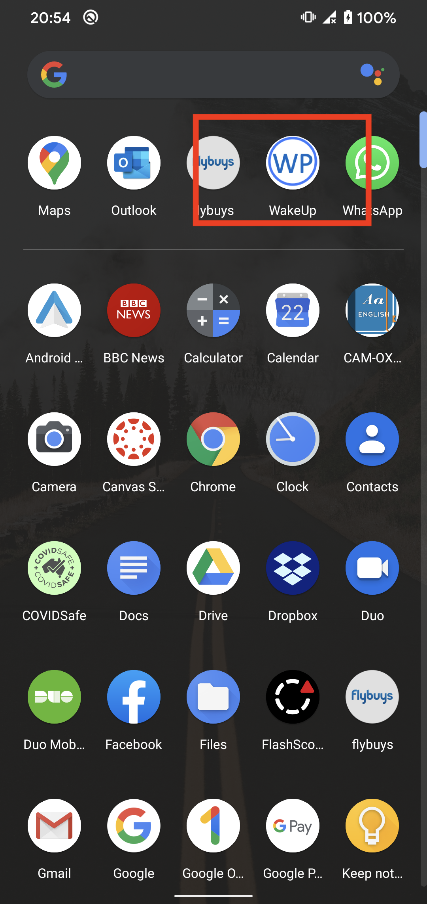
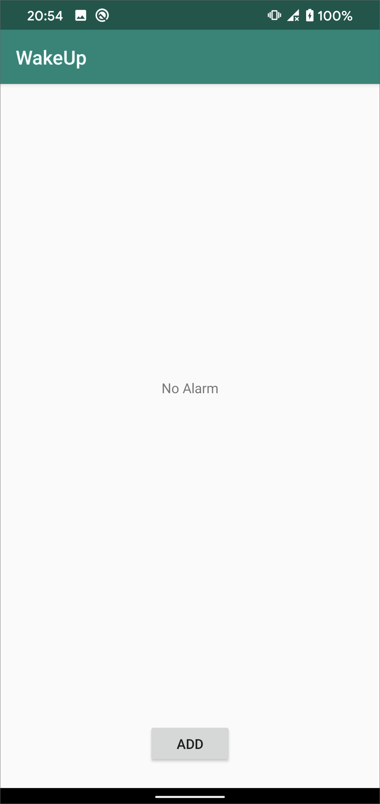
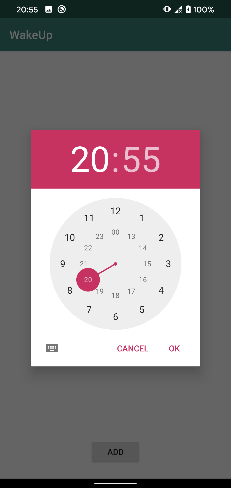
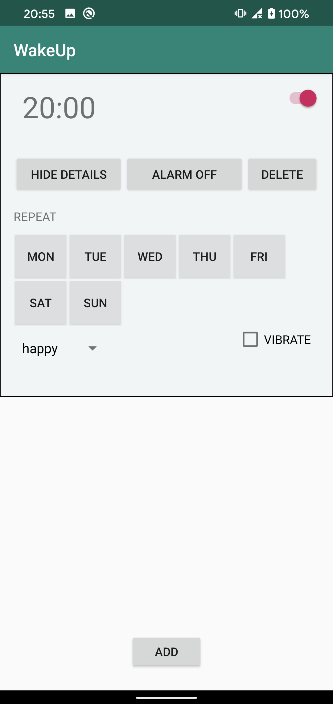
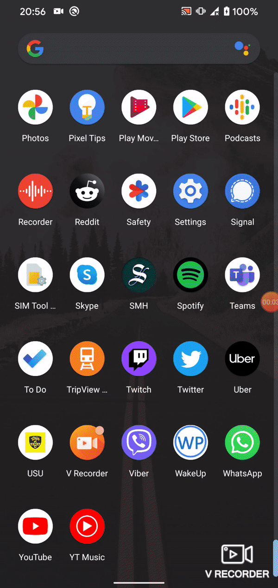

# WakeUp Android Alarm App

This is my first ever android application I have written. The purpose of this personal project was to kill some time during COVID and learn something new by myself in 1-1.5 months.

## Functionality

This app allows user to:

- set 1 alarm clock
- set the repeat days
- select from 3 different ringtone
- set vibrate
- cancel alarm

## Potential Improvements

- let app run even when it is closed
- set multiple alarms
- Rotate screen
- Code refactoring (during learning, I did not put effort into design)
- Visually more appealing UI

**Full video can be found in the *images* folder. Otherwise, have a look at the GIF and images**

## Images

## GIF

